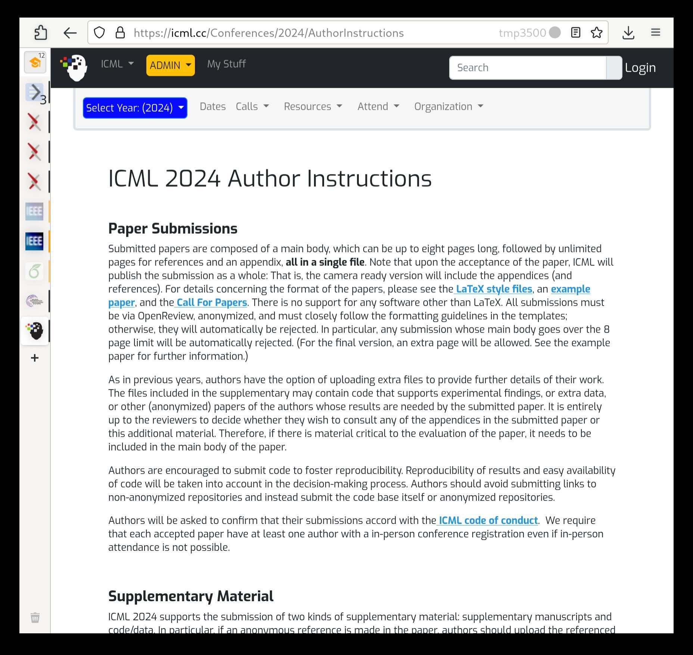
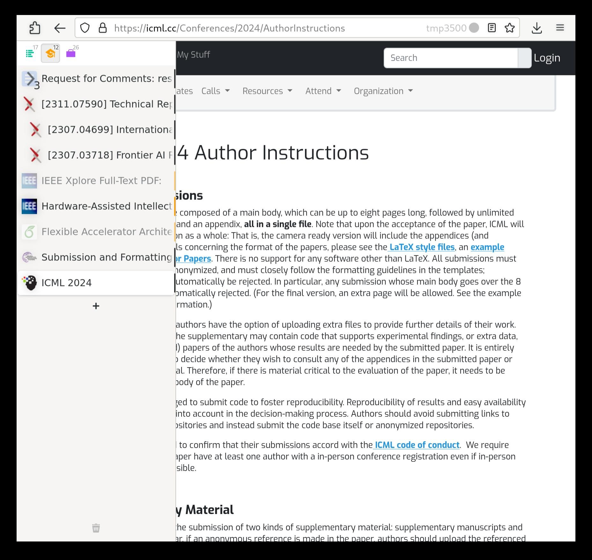

# Firefox Side Tab Controls

## Setup Instructions

1. Install the [Sidebery](https://addons.mozilla.org/en-US/firefox/addon/sidebery/) extension.
2. In the extension settings, go to the "Styles editor" and paste in the contents of [sidebery-styles.css](sidebery-styles.css) from this repository.
3. Type `about:config` into the Firefox address bar and press enter.
4. Search for `toolkit.legacyUserProfileCustomizations.stylesheets` and double-click `false` to change it to `true`.
5. Type `about:support` into the Firefox address bar and press enter.
6. In the first table, "Application Basics", click the "Open Directory" button.
7. Make a new folder in the window that just popped up called `chrome`.
8. Put the contents of the [chrome](chrome) folder from this repository into the new `chrome` folder you just created locally.
9. Restart Firefox and the styles will apply.

Also consider installing some other excellent extensions like [uBlock Origin](https://addons.mozilla.org/en-US/firefox/addon/ublock-origin/), [Firefox Multi-Account Containers](https://addons.mozilla.org/en-US/firefox/addon/multi-account-containers/), and [I don't care about cookies](https://addons.mozilla.org/en-US/firefox/addon/i-dont-care-about-cookies/).

If your sidebar is on the right side of the screen, the visual changes might not work right. In that case, do the following: press Ctrl+b to show the bookmarks sidebar. Click the big star at the top of the sidebar to reveal a dropdown menu, and then select "Move Sidebar Left". Finally, press Ctrl+e to switch back to the normal sidebar. This procedure shouldn't need to be repeated unless you manually move the sidebar to the right again.

Some other Sidebery settings improve the experience when the sidebar is collapsed:

- "Context menu" -> "Use native context menu" allows the menu to escape the bounds of the sidebar. Keeps the context menu open even when the sidebar collapses.
- "Show titles of pinned tabs" makes pinned tabs stack vertically instead of horizontally. This keeps all pinned tabs visible.
- "Navigation bar" -> "Enabled elements" and remove "Create tabs panel" to see your current panel. Note that you can still create new panels easily by right-clicking a tab -> "Move to" -> "New panel".

## Usage

Press Ctrl+e to open and close the tab sidebar. Drag and drop to reorganize tabs; drop on top of another tab to make it a child. Click on a site icon to collapse children tabs, and click on it again to uncollapse. When a site plays media, a speaker will appear in its tab, and clicking that speaker will toggle muting the tab.

The changes from stock Firefox are modular, and can be disabled by modifying the contents of `chrome/userChrome.css` (as described in that file itself). Here's what each part does:

- `user-hover-sidebar.css` makes the sidebar get wider when you hover over it. This gets in the way of manually changing its width, so disable this line to restore usual sidebar behavior.

- `user-simplefox.css` removes many of the normal Firefox UI elements. This could be disorienting, and might require some setup with the built-in "Customize Toolbar" Firefox settings to actually be usable. If it's not for you, disable this line.

- `user-side-tab.css` removes the normal tab bar from the top of the window. If you like having both views (normal along the top, trees along the side) then disable this line.

